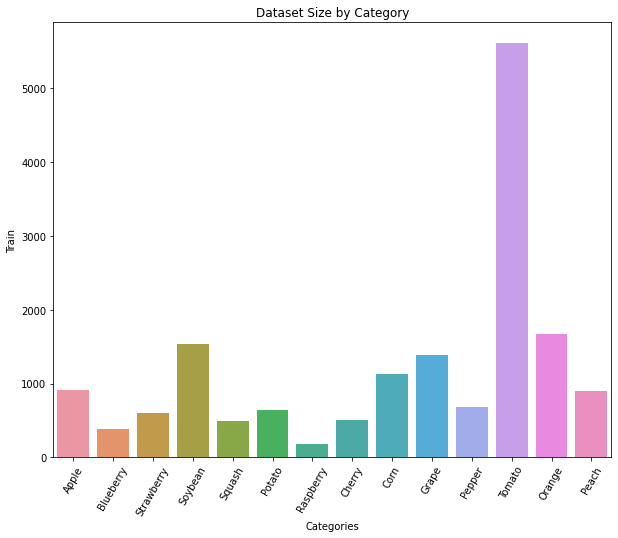
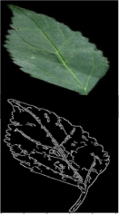
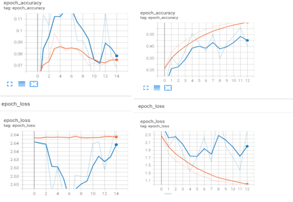
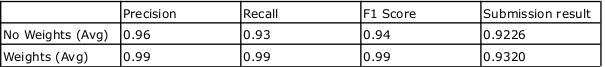
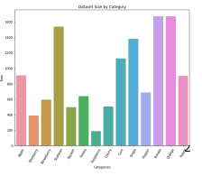
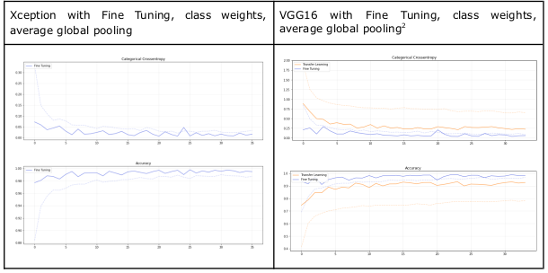

# leaf-plant-classification
Deep Learning models to classify plant leafs

## Report

### Dataset

The given dataset was clearly unbalanced, with a class with a huge number of samples (Tomato, >5000 samples).
We trained the first model on the untouched dataset, to review the initial performance, but we go low accuracy results (as expected).

We considered three possible solutions:
- Introducing class weights

- Undersapmling the dataset

- Oversampling the dataset

Oversampling didn't seem like a good idea, because of the image augmentation we're performing later, and the great discrepancy between class sizes.
Also, the training time would increase.

The dataset was split into three subsets with the following sizes: training (70%), validation (20%) and testing (10% even if not required).
The training subset is kept bigger to have sufficient samples to train a well-performing model, while validation and testing subsets are kept smaller; in particular, 
the testing subset was used to better analyze the model performance.

### Feature Engineering

The dataset was the preprocessed to highlight only notable features of the leaves, such as the leaf shape and venation, while
disregarding colors (whole dataset consisted of green leaves).

The Canny-Edge Detector algorithm (CED) was used to highligh said features.
Below, and example of the leaf before and after the application of the Canny-Edge algorithm.
The implementation is in the attached notebook:
#### CannyEdgeLeafClassification.ipynb

To evaluate this preprocessing we trained a model with and without the modified dataset. The results highlight an important decrease in performance,
so we decided to not proceed in applying the CED algorithm.

Below a comparison between the two models with TensorBoard (Orange = train, Blue = validation, Left image = with CED, Right image = without CED).

### Preprocessing

#### Weights

To mitigate the unbalanced training set, we introduced class weights to reduce the importance of the Tomato class during training and
pay more attention to underrepresented classed (such as Raspberry).
We used SKlearn compute_class_weight to calculate the class weight vector.

The table above shous a good improvement, both in local testing and in the submission result.

### Data Augmentation

In order to reduce overfitting over the small dataset, we performed image augmentation with *ImageDataGenerator*, consisting
of random shifts on the X and Y axis, rotations, vertical and horizontal flips and zoom.
Given that we have (and should have) zero knowledge about the test set, we don't know if the leaves will always be oriented in the same way,
or have a different scale, so it makes sense to perform the aforementioned transformations.
We also normalize the input images (256x256 pixels) to fit in [0, 1] range (floating point), to be closer to the initial weight values
and improve training.

### Undersampling

We then considered undersampling the dataset to mitigate this issue, by reducing the number of samples in the Tomato class to about
the size of the second biggest class (Orange is around 1700 samples). The submission scores were slightly worse (in phase 1:
0.9433 without US vs 0.9396 with US; in phase 2: 0.9349 without US, 0.9207 with US), so we decided not to use it.

### Models

Initially we started from developing some models from scratch, getting discrete results on the validation set (val_accuracy=0.6/0.7),
but low scores on the hidden test set, even when applying preprocessing and feature engineering.
To further improve the model accuracy we adopted transfer learning, trying VGG16, InceptionV3 and Xception, with a simple classifier
on top. This choice is motivated by the fact of having a small dataset that isn't sufficient to train a model with a good generalizing capabilities.
As expected, the results improved. Likewise, fine-tuning further increased the result accuracy (in the VGG case, the submission score in phase 1
went from 0.6641 (no FT) to 0.8773 (with FT).

Overall, the scores obtained are satisfactory (both VGG and Xception result in avg. accuracy > 85%), considering the task the model
will perform (classify leaves) and the small dataset.
As we can see from the following chats, in both Xception and VGG16, before early stopping hits, the model starts to generalize (as expected,
since we're using pre-trained models).

*The model based on Xception is the best performing one therefore we chose it as the final model to submit, also because of its results on the
hidden test set*

### Testing

Once we decided to use transfer learning with fine-tuning and class weights, we tried to adjust minor parts of the model, and compute the
confusion matrices and a classification report, in order to obtain some statistics from the prediction of every single class.

We considered adopting a GlobalAveragePooling2D layer in the classifier, and testing weather or not it yields better results.
In the best performing model (the Xception-based one) it improved the results slightly (around 1%).
In addittion to early stopping, we tested weather using ReduceLROnPlateau would improve the performance of our model, but we got
slightly worse resultss (according to the classification report).

